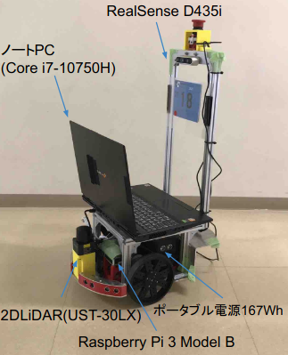

# つくばチャレンジ2021に参加した話

## はじめに
今年から初めて[つくばチャレンジ](https://tsukubachallenge.jp/2021/)に参加しました。
つくばチャレンジの会場には様々な自律移動ロボットがたくさん合ったり、
参加者の方と自律移動についての技術トークができたり、とても刺激を受けました。

今回、初参加ということで色々なことを試しました。

結果的には信号あり横断歩道まで走行することが出来ました！
<blockquote class="twitter-tweet">
本走行は、スタートから信号あり横断歩道まで走行しました。<a href="https://t.co/fZF7aQIi54">https://t.co/fZF7aQIi54</a>
&mdash; BEIKE (@BEIKE_RE) <a href="https://twitter.com/BEIKE_RE/status/1462623996461998083?ref_src=twsrc%5Etfw">November 22, 2021</a></blockquote>  

ということで、つくばチャレンジで試したことなどについて話していきます。

## つくばチャレンジ2021に参加した目的

つくばチャレンジでは、センサをたくさん載せたりしてツヨツヨに強化した機体がよく見られます。
例えば、GNSSやIMUや3D LiDARや色々なカメラや2D LiDAR複数搭載などです。
また、機体のサイズも大きいものが多いような気がします。確かに、ホイールのサイズが大きいと走破性があって安定します。

しかし、あえて私たちのチームは最小構成(2D LiDARのみ)で小型である移動ロボットを使用しています。

その理由は、上記のロボットを使用して出てくる問題に対して、ソフトウェアで実装して対応できるものであれば対応しようというモットーのもとやっているからです。

なので、最小構成で小型である移動ロボットでどこまで走行できるかチャレンジしてみることを目的としました。

## 使用した機体について

つくばチャレンジに参加するために[Raspberry Pi Cat](https://rt-net.jp/products/raspberry-pi-cat/)という機体を使用しました。

つくばチャレンジに参加している機体の中でも小型です。

つくばチャレンジに参加するためには機体の仕様条件として高さが0.6mであるのと
非常停止スイッチがどこからでも押せる必要があります。
なのでアルミフレームを追加して高さ増しをして非常停止スイッチの位置も変更しました。

注：写真ではRealSenseが搭載されてますが、本走行では使用していません。

## つくばチャレンジ2021で試したこと

つくばチャレンジ2021に参加して色々なことを試しました。
その中でも試してよかったことについて4つほど話します。

* 2D LiDARの位置調整

ソフトウェアで何でも解決させると言っておきながら調整してるのかいと思う方がいるかもしれませんが、流石に許してください。

安定した自己位置推定を行うためにランドマークを獲得することは重要です。
なので、どの高さの位置に2D LiDARを設置するべきなのか現地で計測して最適な値を導きました。(多分)

花壇やベンチの高さを計測した所、地面から45cmぐらいの高さに2D LiDARを設置すると
花壇やベンチをマップに含ませることが出来ます。マップに含まれるということは走行中に観測ができるということです。

* マッピング・自己位置推定テスト用のシステム作成

マッピングや自己位置推定のテストをチーム全体で簡単にできれば良いなと思ったので、システムを作りました。これのおかげでマッピングや自己位置推定のテストを他のメンバーに任せることが出来ました。

DockerとROSがインストールされていれば、実行することが出来ます。
rosbagは[google driveで管理されていて](https://drive.google.com/drive/u/2/folders/10M9LNWEwlFVunHTv-vx0vhNK5xqopGc_)実行したいrosbagを選択すれば使用することが出来ます。

* 合成したマップの使用

本走行2日前に確認走行エリアを完走しました。

その時、確認走行エリアの分のマップ作成は終わっていましたが確認走行エリア以降から信号あり横断歩道までのマップは未完成でした。

rosbag取る時間とmappingを行う時間を考えたのと確認走行エリアの分のマップは
実際に完走できたマップであることから再利用した方が良いと考えました。

そこでGIMPを使用してマップの合成を行いました。
確認走行エリアのマップと確認走行エリア以降から信号あり横断歩道までのマップを合成しました。

* 自己位置推定用と経路計画用にマップを分ける

期待通りの経路計画を行ってくれるようにマップの編集を行いました。

当然、過度に編集したマップは自己位置推定に使用すると支障を来すので[別々にする必要](https://github.com/uhobeike/raspicat_navigation/blob/832165b142f9460742062f679fcc6eaf3a092244/launch/raspicat_navigation.launch#L18-L24)があります。

何が期待通りかというと、以下の写真のように線で囲まれた範囲内でしか経路計画が行われないということです。線の範囲外に行くとロボットがスタックする可能性があるので線の範囲内で走行するようにマップを以下の写真のように編集しました。

スタックしそうな場所の例を２つほど紹介させて頂きます。

### ①芝生エリア

車輪経が小さいこともあり、一度芝生エリアに入ると芝生エリアから戻る際にスタックしそうなので避けた方が良さそうです。

### ②横断歩道の段差

これは実際にスタックした例ですが、やはり車輪経が小さいため横断歩道の段差を乗り越えるのが
厳しく、結果的に自己位置推定にも影響が出てしまいました。

<blockquote class="twitter-tweet">
小型ロボットは辛い2 <a href="https://twitter.com/hashtag/%E3%81%A4%E3%81%8F%E3%83%81%E3%83%A3%E3%83%AC?src=hash&amp;ref_src=twsrc%5Etfw">#つくチャレ</a> <a href="https://t.co/Vq0mxatPHi">pic.twitter.com/Vq0mxatPHi</a>
&mdash; 千葉工大未ロボ上田研 (@uedalaboratory) <a href="https://twitter.com/uedalaboratory/status/1461934150328504320?ref_src=twsrc%5Etfw">November 20, 2021</a></blockquote>  

動画を見ると右側が段差になっていて左側がスロープになっていることがわかります。右側の段差を避けて通るような経路計画をすれば問題なく走行する事が出来ます。

マップを編集する時にふと思ったのですが、通りたくないと設定した領域を上手く利用して
ロボットの存在確率をその領域だけ高くするのもありなのではと考えました。パーティクルが誘拐され全く別の場所にワープしてしまうことがあるので、その対策として効果的であるか気になります。

* つくばチャレンジ用に作成したシミュレータ環境の活用

マッピングや自己位置推定のテストを行うのは、rosbagを使用することで可能です。

rosbagのようにナビゲーションもつくばチャレンジの現地に近いデータでテスト出来たら良いなと思い、下の記事のように2次元のマップからGazeboのモデルを作成しました。

<blockquote class="twitter-tweet">
10LGTM！ | 2次元地図からGazeboのmodelを作ってナビゲーションしてみた by <a href="https://twitter.com/BEIKE_RE?ref_src=twsrc%5Etfw">@BEIKE_RE</a> <a href="https://t.co/Z5TnKlt7YG">https://t.co/Z5TnKlt7YG</a>
&mdash; Qiitaマイルストーン (@qiita_milestone) <a href="https://twitter.com/qiita_milestone/status/1466917672373960704?ref_src=twsrc%5Etfw">December 3, 2021</a></blockquote>  

これは、本走行前日の夜に作成したワールドです。
色々あってwaypointを一から置き直す必要がありました。
本走行は1度きりなので、以下のワールドを使用することで事前にテスト(確認)を行うことが出来ました。

確認したことは、waypointの置きミスやマッピングの際に出来た余計な障害物やパスプランです。

### 実際にナビゲーションのテストをしている様子

<iframe width="1280" height="320" src="https://www.youtube.com/embed/tRTD174K4bE" title="YouTube video player" frameborder="0" allow="accelerometer; autoplay; clipboard-write; encrypted-media; gyroscope; picture-in-picture" allowfullscreen></iframe>

## 今後について

現在、経路計画においてはmove_baseを使用しており、元々あるリソースを上手く使用している状況です。中身のアルゴリズムやシステムに関してはブラックボックスとして扱ってきてしまってます。

何か対応するべき時に中身を理解してないと、いざという時に対応できない問題があったりするので経路計画や障害物回避などを自分たちで実装するなどをしてチーム全体でレベルアップを図っていきたいと思っています。

## チームメンバー

* 
* 
* 
* 
* 