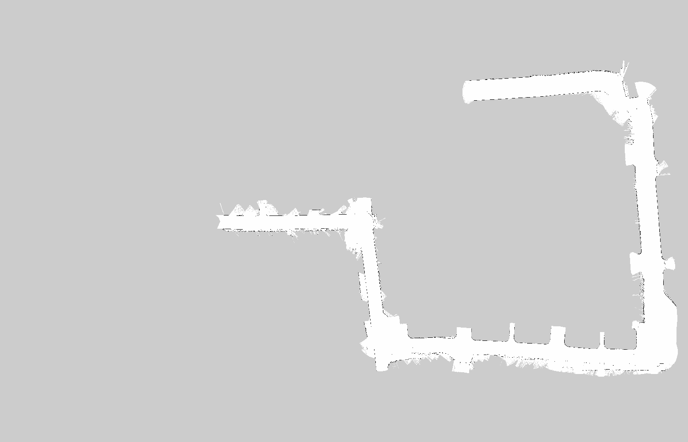
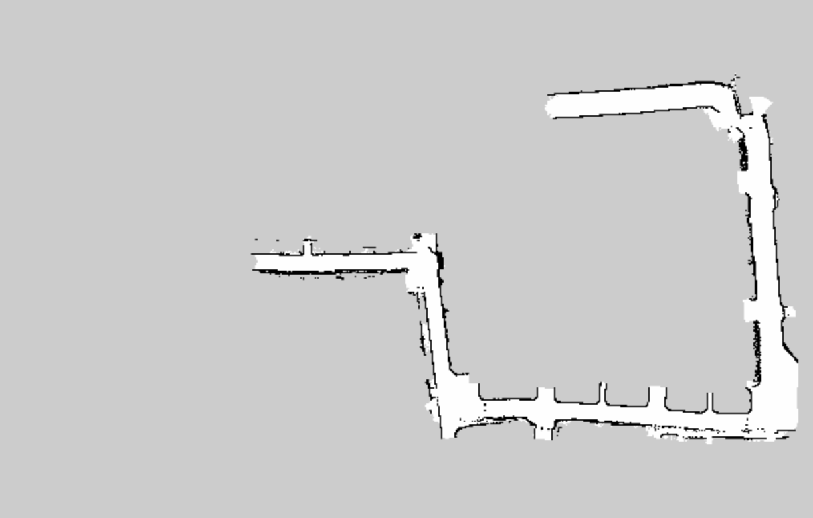
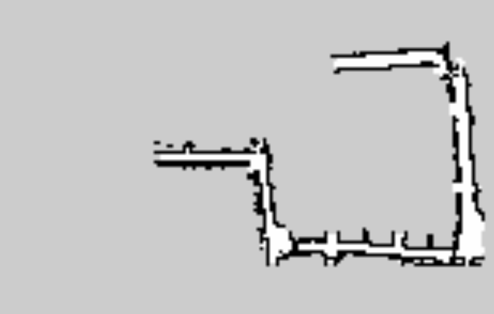

# pgmファイルのサイズ変更実験

## 実験環境

使用する画像

使用するコード

https://github.com/YuichiroHatanaka/map_compression

使用言語は python, 環境は Jupyter Notebook を用いる。

## 実験結果

サイズ 1/10

サイズ 1/40

## 議論

サイズ1/40は地図として機能しないのでは？

## 結論・今後の展望

実際に実験をし、地図の正確さがある程度あるようにするにはどのサイズが適切かを調査したい。
実験をするときはまず、室内を走らせて行きたい。
